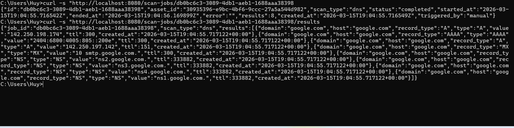
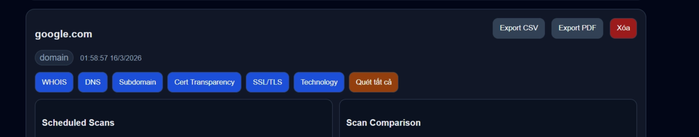

# Untitled

BTVN-DAY3-Nguyễn-Hữu-Đức-Anh 

link demo : [https://easm.duckdns.org](https://easm.duckdns.org/)

```
- [x] Bài 1: Mở rộng Scan API
- [x] Bài 2: Viết Unit Tests
- [x] Bài 3: Tích hợp Frontend
- [x] Bài 4: CI/CD với GitHub Actions
- [x] Bài 5: Deploy với Docker Compose
- [x] Bài 6: Tính năng EASM mới (Bonus)
- [x] Bài 7: Deploy lên Cloud VM (Bonus)
- [x] Bài 8: Domain & TLS/HTTPS (Bonus)
- [x] Bài 9: Auto Deploy on Merge (Bonus)
```

Bài 1:
# `Check scan status`
`Get scan results`



#`Get all results for an asset`
`List all scans for an asset`


Bài 2:

Test all


Bài 3:

Trang danh sách nội dung có dữ liệu 


Hoạt động của tài sản tạo biểu mẫu:

-Người dùng chọn các options để scan có options lập lịch theo phút xuất file báo cáo csv/pdf




-Kết quả scan 

Bài 4:


Bài 5:


Bài 7:


Bài 8:

